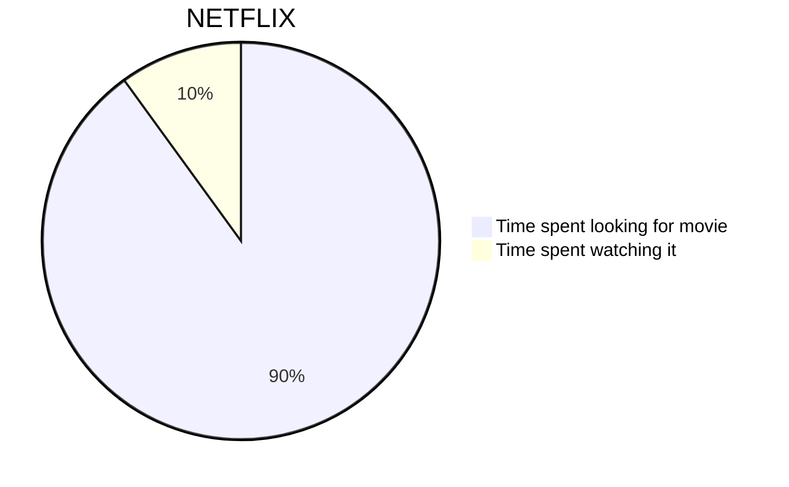

# Markdown 语法

## 基础语法

Halo 是用的 `Markdown` 解析器为 [flexmark-java](https://github.com/vsch/flexmark-java)，基于 [CommonMark (spec 0.28)](https://spec.commonmark.org/0.28/) 标准开发，语法参考：[https://spec.commonmark.org/0.28/](https://spec.commonmark.org/0.28/)。

## 代码块

````markdown
```language
代码块
```
````

其中，language 为必填，如果不填写，很可能主题的代码高亮插件无法识别代码的语言，导致样式异常。举几个例子：

````markdown
```java
public  static  void main(String[] args){
    System.out.println("Hello World!");
}
```
````

````markdown
```javascript
console.log("Hello World!")
```
````

## 自动链接

支持自动将一个链接解析为可点击的格式，如下：

````markdown
https://halo.run
````

将被解析为：

```html
<a  href="https://halo.run">https://halo.run</a>
```

## Emoji

支持将 Emoji 的文字形式转化为图片形式，如下：

```markdown
:100:
```

将被解析为：

```html
💯
```

更多 Emoji 表情可访问：[https://emoji.svend.cc](https://emoji.svend.cc)

## 数学公式

行内公式：

```markdown
$a \ne 0$
```

段落公式：

```markdown
$$
x = {-b \pm \sqrt{b^2-4ac} \over 2a}.
$$
```

Q&A：

Q：编辑器可以显示公式，为啥发布之后前台看不了？你这不是瞎写吗？

A：不是！你需要知道的是，并不是所有主题都支持显示公式。这时候，你就需要自己添加解析插件了。

Q：那是要我改代码吗？改 Halo 还是主题？这我也不会啊？那怎么办？你能帮帮我吗？

A：别老想去改代码了。添加的方法很简单：

首先，登陆到后台，进入 系统 -> 博客设置 -> 其他设置。将下面的代码复制到 `自定义内容页面 head`。

```html
<script src="//cdn.jsdelivr.net/npm/mathjax@2.7.5/unpacked/MathJax.js?config=TeX-MML-AM_CHTML" defer></script>
    <script>
    document.addEventListener('DOMContentLoaded', function () {
        MathJax.Hub.Config({
            'HTML-CSS': {
                matchFontHeight: false
            },
            SVG: {
                matchFontHeight: false
            },
            CommonHTML: {
                matchFontHeight: false
            },
            tex2jax: {
                inlineMath: [
                    ['$','$'],
                    ['\\(','\\)']
                ],
                displayMath: [["$$", "$$"], ["\\[", "\\]"]]
            }
        });
    });
</script>
```

## 图表

饼图：

````markdown

````

更多用法查看：[https://mermaidjs.github.io/#/](https://mermaidjs.github.io/#/)

Q&A：

Q：同上，这也是编辑器可显示，前台显示不了啊？

A：添加插件的方法和上面的一样：

首先，登陆到后台，进入 系统 -> 博客设置 -> 其他设置。将下面的代码复制到 `自定义内容页面 head`。

```html
<script src="https://cdn.jsdelivr.net/npm/mermaid@8.4.4/dist/mermaid.min.js"></script>
```

## 短连接

Halo 内置一些短连接以更好地支持一些 HTML 语法，但是编辑器目前并不能解析，只能发布之后才可以看到效果，如下：

### 网易云音乐

```markdown
[music:id]
```

示例：

```markdown
[music:32507038]
```

将被解析为：

```html
<iframe  frameborder="no" border="0"  marginwidth="0"  marginheight="0"  width=330  height=86  src="//music.163.com/outchain/player?type=2&id=32507038&auto=1&height=66"></iframe>
```

### 哔哩哔哩动画

```markdown
[bilibili:aid,width,height]
```

示例：

```markdown
[bilibili:65898131,256,256]
```

将被解析为：

```html
<iframe  height="256"  width="256"  src="//player.bilibili.com/player.html?aid=65898131"  scrolling="no" border="0"  frameborder="no"  framespacing="0"  allowfullscreen="true">  </iframe>
```
